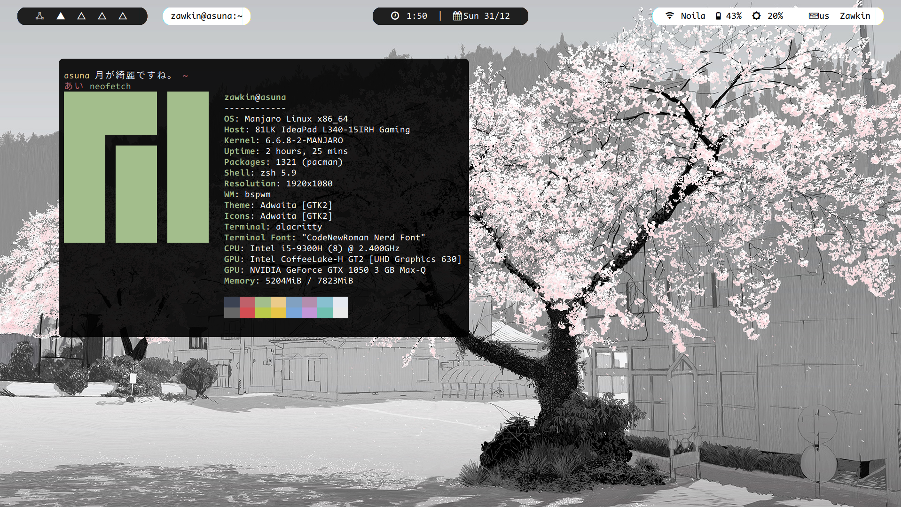

# monochrome-configs

- **OS:** [`Arch Linux 'x86_64'`](https://archlinux.org/)
- **Terminal:** [`alacritty`](https://github.com/alacritty/alacritty)
- **Bar:** [`polybar`](https://github.com/polybar/polybar)
- **Compositor:** [`picom`](https://github.com/yshui/picom)
- **Screenshot tool:** [`flameshot`](https://flameshot.org)
- **Hotkey daemon:** [`sxhkd`](https://github.com/baskerville/sxhkd)
- **Fonts:** [`CommitMono Nerd Font`](https://www.nerdfonts.com/font-downloads)

## Theme founder: [@orzklv](https://github.com/orzklv)
